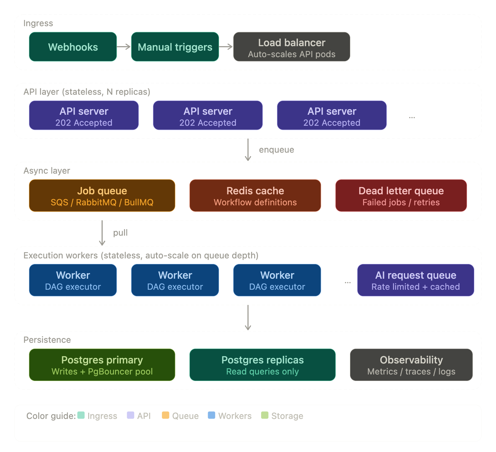

# Workflow Automation Builder

A visual, node-based workflow automation platform. Build, configure, and execute multi-step data pipelines through a drag-and-drop canvas — no code required.

---

## Table of Contents

- [Overview](#overview)
- [Architecture](#architecture)
- [Features](#features)
- [Tech Stack](#tech-stack)
- [Project Structure](#project-structure)
- [Installation](#installation)
- [Running Locally](#running-locally)
- [Environment Variables](#environment-variables)
- [How Workflow Execution Works](#how-workflow-execution-works)
- [Example Workflow](#example-workflow)
- [Test Scenarios](#test-scenarios)
- [Future Improvements](#future-improvements)
- [Scaling to 10,000+ Concurrent Users](#scaling)

---

## Overview

Workflow Automation Builder lets you visually compose automation pipelines by connecting nodes on a canvas. Each node performs a discrete operation — receiving a webhook, transforming data, evaluating conditions, sending emails, or calling an AI provider. When triggered, the engine traverses the graph, executes each node in order, and records a full execution log.

---

## Architecture

```
┌─────────────────────────────────────────────────────────────┐
│                        Browser (React)                      │
│                                                             │
│  ┌──────────────┐   ┌──────────────┐   ┌────────────────┐   │
│  │  Node Palette│   │  React Flow │   │  Right Panel   │  │
│  │  (drag nodes)│   │   Canvas    │   │  Config / Run  │  │
│  └──────────────┘   └──────┬───────┘   └────────────────┘   │
│                             │ serialize                     │
└─────────────────────────────┼───────────────────────────────┘
                              │ REST API (JSON)
┌─────────────────────────────▼───────────────────────────────┐
│                     Express.js Backend                      │
│                                                             │
│  ┌─────────────┐   ┌──────────────────────────────────────┐ │
│  │  REST Routes │   │         Execution Engine            │ │
│  │  /workflows  │   │                                     │ │
│  │  /webhook    │   │  ┌──────────┐   ┌────────────────┐  │ │
│  │  /executions │   │  │ Executor │──▶│ Node Handlers  │  │ │
│  └──────┬───────┘   │  │ (graph   │   │ webhook        │  │ │
│         │           │  │  walker) │   │ transform      │  │ │
│         │           │  └──────────┘   │ condition      │  │ │
│         │           │                 │ email          │  │ │
│         │           │                 │ delay / ai     │  │ │
│         │           │                 └────────────────┘  │ │
│         │           └──────────────────────────────────────┘│
│         │                                                   │
│  ┌──────▼──────────────────────────────────────────────────┐│
│  │                    Prisma ORM                           ││
│  └──────────────────────────┬────────────────────────────┘  │
└─────────────────────────────┼───────────────────────────────┘
                              │
              ┌───────────────▼───────────────┐
              │         PostgreSQL            │
              │  workflows + workflow_results │
              └───────────────────────────────┘
```

**Data flow summary:**

1. User builds a workflow on the canvas and clicks **Save**
2. `serializeFlow()` converts React Flow nodes/edges → `WorkflowDef` JSON → `PUT /api/workflows/:id`
3. User clicks **Run** with a JSON payload → `POST /api/workflows/:id/trigger`
4. Backend returns `executionId` immediately (202 Accepted), execution runs async in background
5. Frontend polls `GET /api/executions/:executionId` until `status !== "running"`
6. Results panel renders the execution log per node

---

## Features

- **Visual canvas** — drag, drop, and connect nodes using React Flow
- **7 node types** — Webhook, Transform, Condition, Email, Delay, AI, Store
- **Conditional branching** — route data down different paths based on field values (`equals`, `not_equals`, `contains`, `gt`, `lt`)
- **Parallel fan-out** — standard nodes propagate to all downstream nodes simultaneously
- **Field interpolation** — use `{{fieldName}}` placeholders in any text config
- **AI email generation** — generate email bodies using OpenAI or Google Gemini
- **Async execution** — trigger returns immediately, results polled separately
- **Full execution log** — per-node input/output, status, and duration recorded
- **Dev mode email** — emails log to console when SMTP is not configured
- **Structured logging** — pino-based logs with `executionId` context throughout

---

## Tech Stack

| Layer | Technology |
|-------|-----------|
| Frontend | React 18, TypeScript, Vite |
| Canvas | React Flow |
| UI Styling | Tailwind CSS |
| State Management | Zustand |
| Routing | React Router DOM v6 |
| Backend | Node.js, Express.js, TypeScript |
| ORM | Prisma v5 |
| Database | PostgreSQL |
| Logging | Pino + pino-pretty |
| Email | Nodemailer |
| AI Providers | OpenAI API / Google Gemini API |
| Validation | Zod |
| ID Generation | uuid |

---

## Project Structure

```
liveCoding/
├── backend/
│   ├── prisma/
│   │   └── schema.prisma          # Database schema
│   └── src/
│       ├── ai/                    # AI provider factory + utils
│       ├── db/                    # Prisma client singleton
│       ├── engine/                # Workflow execution engine
│       │   ├── executor.ts        # Graph walker + routing logic
│       │   ├── registry.ts        # Node handler registry
│       │   └── types.ts           # Shared engine types
│       ├── middleware/            # Express middleware (logger, error handler, validator)
│       ├── nodes/                 # Node handler implementations
│       ├── repositories/          # Database access layer
│       ├── routes/                # Express route definitions
│       ├── services/              # Business logic layer
│       ├── utils/                 # Shared utilities (logger, errors, interpolate)
│       ├── app.ts                 # Express app factory
│       ├── config.ts              # Env-based config
│       └── server.ts              # HTTP server entry point
└── frontend/
    └── src/
        ├── components/
        │   ├── canvas/            # Canvas toolbar, palette, workflow canvas
        │   ├── nodes/             # Per-type React Flow node components
        │   └── panels/            # Config, Trigger, Results panels
        ├── hooks/                 # useWorkflow, useExecution
        ├── pages/                 # WorkflowListPage, WorkflowEditorPage
        ├── store/                 # Zustand stores (workflow, execution)
        ├── types/                 # Shared TypeScript types
        └── utils/                 # serializeFlow, deserializeFlow
```

---

## Installation

**Prerequisites:** Node.js ≥ 18, PostgreSQL running locally (or a connection string)

```bash
# Clone the repository
git clone <repo-url>
cd liveCoding

# Install backend dependencies
cd backend && npm install

# Install frontend dependencies
cd ../frontend && npm install
```

---

## Running Locally

### 1. Configure environment variables

```bash
# backend/.env
cp backend/.env.example backend/.env
# Edit backend/.env with your DATABASE_URL and other values
```

### 2. Run database migrations

```bash
cd backend
npx prisma migrate dev
```

### 3. Start the backend

```bash
cd backend
npm run dev
# Starts on http://localhost:3000
```

### 4. Start the frontend

```bash
cd frontend
npm run dev
# Starts on http://localhost:5173
```

---

## Environment Variables

### Backend (`backend/.env`)

| Variable | Required | Description |
|----------|----------|-------------|
| `DATABASE_URL` | Yes | PostgreSQL connection string (pooled) |
| `DIRECT_URL` | No | Direct DB URL (used by Prisma Migrate) |
| `PORT` | No | HTTP port (default: `3000`) |
| `NODE_ENV` | No | `development` or `production` |
| `CORS_ORIGIN` | No | Allowed frontend origin (default: `http://localhost:5173`) |
| `SMTP_HOST` | No | SMTP server host (omit for dev console logging) |
| `SMTP_PORT` | No | SMTP server port (default: `587`) |
| `SMTP_USER` | No | SMTP username |
| `SMTP_PASS` | No | SMTP password |
| `OPENAI_API_KEY` | No | OpenAI API key (required if using AI nodes) |
| `GEMINI_API_KEY` | No | Google Gemini API key (alternative to OpenAI) |

### Frontend (`frontend/.env`)

| Variable | Required | Description |
|----------|----------|-------------|
| `VITE_API_BASE_URL` | No | Backend base URL (default: `http://localhost:3000`) |

---

## How Workflow Execution Works

Workflows are directed acyclic graphs (DAGs). The execution engine walks the graph recursively starting from all **start nodes** (nodes with no incoming edges).

```
Trigger
  │
  ▼
Webhook  ──► [passes payload through unchanged]
  │
  ▼
Transform ──► [renames/maps fields using FieldMappings]
  │
  ▼
Condition ──► [evaluates a field against branches]
  │               │
  │   match       │  no match
  ▼               ▼
Email           [halt]
```

**Routing rules:**

- **Standard nodes** fan out to *all* outgoing edges in parallel (`Promise.all`)
- **Condition nodes** follow *only the one edge* whose `condition` property matches `_branch` (the matched branch value)
- If no branch matches, `_branch` is `null` and execution halts cleanly on that path (overall status still `completed`)

**`_branch` routing key:**

The branch `value` field (e.g., `"35"`) serves a dual purpose:
1. It is the comparison operand evaluated by the condition handler
2. It becomes the `condition` label on the outgoing edge — the executor matches `edge.condition === _branch`

---

## Example Workflow

**High Temperature Alert** — triggers an email when sensor data exceeds 35°C.

```
Webhook ──► Transform ──► Condition ──"35"──► Email
```

### Node configuration

**Transform**
| Source | Target | Value |
|--------|--------|-------|
| `temperature` | `temp_celsius` | |
| | `unit` | `celsius` |

**Condition**
- Field: `temp_celsius`
- Branch: operator `gt`, value `35`

**Email**
- To: `{{alert_email}}`
- Subject: `High Temperature Alert — {{location}}`
- Body: `Temperature is {{temp_celsius}}°C at {{location}}, exceeding the 35°C threshold.`

### Trigger payload

```json
{
  "temperature": 42,
  "location": "Server Room A",
  "alert_email": "ops@company.com"
}
```

### Expected final output

```json
{
  "location": "Server Room A",
  "alert_email": "ops@company.com",
  "temp_celsius": 42,
  "unit": "celsius",
  "_branch": "35",
  "email_sent": true,
  "email_to": "ops@company.com",
  "email_subject": "High Temperature Alert — Server Room A"
}
```

---

## Test Scenarios

| # | Description | Nodes | Key Assertion |
|---|-------------|-------|---------------|
| 1 | Webhook passthrough | Webhook | Output equals input payload |
| 2 | Field rename | Webhook → Transform | `temperature` deleted, `temp_celsius` added |
| 3 | Static value injection | Webhook → Transform | `unit: "celsius"` added |
| 4 | `gt` numeric condition → Email | Webhook → Transform → Condition → Email | `email_sent: true` when temp > 35 |
| 5 | Condition no-match halt | Same as above | `_branch: null`, email skipped, status `completed` |
| 6 | `equals` string branch | Webhook → Condition → Email | Routes on exact string match |
| 7 | AI node JSON parse | Webhook → AI | Parsed keys merged into output |
| 8 | AI node fallback | Webhook → AI | `ai_response` set when JSON parse fails |
| 9 | Delay node | Webhook → Delay → Email | Execution pauses for configured `delayMs` |
| 10 | Store node persistence | Any pipeline → Store | `workflow_results` row written to DB |

---

## Future Improvements

- **Loop / iteration nodes** — process arrays of items
- **Sub-workflow nodes** — embed one workflow inside another
- **Retry logic** — configurable retry count and backoff for failing nodes
- **Webhook authentication** — HMAC signature verification on incoming triggers
- **Execution history UI** — browse and replay past executions per workflow
- **Import / export** — download and upload workflow JSON
- **Role-based access control** — multi-user with per-workflow permissions
- **Real-time execution streaming** — WebSocket updates instead of polling
- **More node types** — HTTP Request, Slack, database query, custom code
- **Test mode** — dry-run with mocked external calls (email, AI)

---

## Scaling to 10,000+ Concurrent Users

### 1. Stateless API Layer — Scale Horizontally
Run multiple instances of the backend behind a load balancer (e.g. AWS ALB or NGINX). Since each request should carry all needed context, any instance can handle any request. Add auto-scaling rules based on CPU/memory thresholds.

### 2. Separate the Execution Engine from the API
Don't run workflow executions inline with API requests. Push every execution into a job queue (e.g. BullMQ, SQS, or RabbitMQ). Workers pull jobs and execute DAGs independently. This decouples request latency from execution time entirely.

### 3. Workflow Execution Workers — Scale Independently
Run a dedicated pool of worker processes (separate from the API). Workers are stateless and can be scaled horizontally based on queue depth. Long-running or complex DAGs don't block incoming webhook requests.

### 4. Database — Read Replicas + Connection Pooling
Use PostgreSQL with read replicas for queries (fetching workflow definitions, reading results). Route writes (saving results, execution logs) to the primary. Use PgBouncer or RDS Proxy to manage connection pooling — raw DB connections are expensive at scale.

### 5. Caching Workflow Definitions
Workflow definitions rarely change but are read on every execution. Cache them in Redis with a short TTL. This eliminates redundant DB reads per webhook hit and dramatically reduces load at high throughput.

### 6. Async Webhook Acknowledgement
When a webhook fires, immediately respond with `202 Accepted` and enqueue the execution. Never block the HTTP response on workflow completion. Callers can poll a status endpoint or subscribe to a callback URL for results.

### 7. Distributed Queue with Dead Letter Handling
Use a battle-tested queue (SQS, Kafka, or RabbitMQ) with: retry policies for transient failures, dead letter queues for permanently failed jobs, visibility timeouts to prevent duplicate execution on worker crashes.

### 8. AI Node Rate Limiting + Batching
At scale, AI nodes (LLM calls) will be the bottleneck. Implement: per-user rate limiting, a dedicated AI request queue with concurrency controls, optional result caching for identical prompts (hash the input + prompt → cache output).

### 9. Execution Result Storage
Write execution results asynchronously and in bulk. Use append-only writes, and for analytics/history, consider a time-series-friendly setup (Timescale or DynamoDB) rather than scanning a large Postgres table with full execution logs.

### 10. Observability from Day One
You cannot debug distributed systems without metrics. Instrument: queue depth and worker lag (Grafana/CloudWatch), per-node execution latency, failure rates per node type, webhook throughput. Add distributed tracing (OpenTelemetry) so you can follow a single execution across services.



Tests


Deployment


